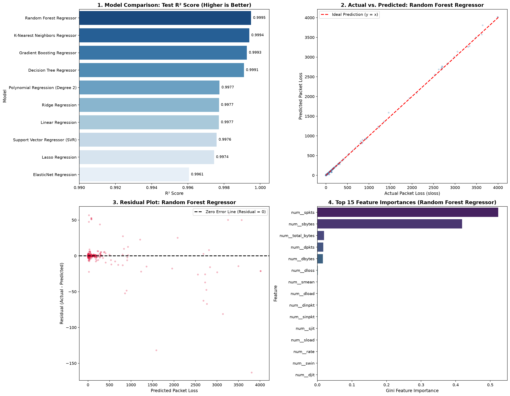

<div align="center">

# 🛡️ NetSentinel

### NetSentinel: QoS-Aware Network Intrusion Detection Using Comparative Machine Learning

[](https://www.python.org/)
[](https://scikit-learn.org/)
[](https://jupyter.org/)
[](https://github.com/ajay9376/NetSentinel)
[](https://github.com/ajay9376/NetSentinel)

---

</div>

## 🌐 Overview

**NetSentinel** is a B.Tech CSE (**23CSE301 Machine Learning Capstone**) project that performs comparative machine-learning analysis across three independent tracks:

* 📈 **Regression** — Predicting continuous network Quality of Service (QoS) degradation and source packet loss (`sloss`).
* 🛡️ **Classification** — Classifying network communication flows into multi-class intrusion activities and benign traffic.
* 🧩 **Clustering** — Unsupervised grouping and structural profiling of network communication behaviors.

Each machine learning track is conducted independently using a dedicated, domain-standard benchmark dataset:
* **Regression Track**: UNSW-NB15 dataset
* **Classification Track**: CIC-IDS2017 dataset
* **Clustering Track**: CTU-13 dataset

---

## 🎯 Problem Statement

Modern network infrastructures require automated, machine-learning-driven monitoring to maintain Quality of Service (QoS) and defend against malicious cyber threats. This capstone project addresses three core operational challenges in network traffic analysis:

* 📈 **QoS & Traffic Degradation Prediction**: Estimating continuous performance indicators (such as packet loss or latency metrics) from flow telemetry to proactively optimize network resources.
* 🛡️ **Network Intrusion Classification**: Accurately distinguishing benign traffic from diverse attack vectors (e.g., DoS, Port Scans, Brute Force, Web Attacks, Infiltration) across multi-class threat scenarios.
* 🧩 **Unsupervised Traffic Behaviour Profiling**: Discovering hidden traffic structures, anomaly patterns, and operational clusters without prior label annotations.

---

## 📊 Datasets

| Track | Dataset | Target / Task | Purpose / Source |
| :--- | :--- | :--- | :--- |
| **Regression** | **UNSW-NB15** | Continuous Source Packet Loss (`sloss`) | Network traffic QoS regression (ACCS / UNSW) |
| **Classification** | **CIC-IDS2017** | Multi-class Threat Label (`Label`) | Network attack classification (CIC / UNB) |
| **Clustering** | **CTU-13** | Unsupervised Traffic Clustering | Behavioral anomaly analysis (Stratosphere IPS / CTU) |

> [!NOTE]
> The raw regression dataset (`UNSW_NB15_training-set.csv`) and classification dataset (`network_traffic_classification.csv`) are placed within their respective `data/` directories as documented in each folder's README.

---

## 📁 Project Structure

```text
NetSentinel/
├── README.md
├── requirements.txt
├── .gitignore
│
├── data/
│   ├── regression/
│   │   ├── UNSW_NB15_training-set.csv
│   │   └── README.md
│   ├── classification/
│   │   ├── network_traffic_classification.csv
│   │   └── README.md
│   └── clustering/
│       └── README.md
│
├── notebooks/
│   ├── regression.ipynb
│   ├── classification.ipynb
│   ├── clustering.ipynb
│   └── final_regression_diagnostics.png
│
├── models/
│   ├── regression_inference.py
│   └── README.md
│
└── app/
    └── .gitkeep
```

---

## 🔬 Machine Learning Tracks

### 📈 1. Regression Track (Evaluated in Review 1)
* **Dataset**: UNSW-NB15 (`data/regression/UNSW_NB15_training-set.csv`, 175,341 rows)
* **Target Variable**: `sloss` (Source packet loss continuous metric)
* **Leakage Removal**: Excluded `id`, `attack_cat`, `label`, and `sloss` from predictors.
* **Engineered Feature**: `total_bytes = sbytes + dbytes` (bidirectional flow volume).
* **Single Standardized Partition**: 80:20 train-test split (`random_state=42`) with `StandardScaler` and `OneHotEncoder` fitted strictly on training data.
* **All 10 Required Algorithms**:
  1. Linear Regression (OLS Baseline)
  2. Ridge Regression ($L_2$ Regularization)
  3. Lasso Regression ($L_1$ Regularization)
  4. ElasticNet Regression (Combined $L_1 + L_2$)
  5. Polynomial Regression (Degree 2 on top correlated features)
  6. Decision Tree Regressor
  7. Random Forest Regressor
  8. Gradient Boosting Regressor
  9. Support Vector Regressor (SVR)
  10. K-Nearest Neighbors Regressor (KNN)
* **Required Metrics**: $R^2$ Score, RMSE, MAE, and 5-Fold Cross-Validation for the top 2 models.

---

### 🛡️ 2. Classification Track (Part A in Review 1, Part B in Review 2)
* **Dataset**: CIC-IDS2017 (`data/classification/network_traffic_classification.csv`, 8,000 flow instances)
* **Target Variable**: `Label` (9 discrete classes: BENIGN + 8 threat categories including DoS, PortScan, Brute Force, Web Attacks)
* **Single Standardized Partition**: Stratified 80:20 train-test split (`random_state=42`) with `StandardScaler` fitted strictly on training data.
* **Review 1 — Part A Algorithms**:
  1. Logistic Regression (Multinomial baseline)
  2. K-Nearest Neighbors (KNN)
  3. Gaussian Naive Bayes
  4. Decision Tree Classifier
  5. Support Vector Machine (SVC)
* **Review 2 — Part B Algorithms**:
  6. Random Forest Classifier
  7. AdaBoost Classifier
  8. Gradient Boosting Classifier
  9. Bagging Classifier
  10. Multi-Layer Perceptron (MLP) Classifier
* **Required Metrics**: Accuracy, Precision, Recall, Weighted $F_1$-score, Macro $F_1$-score, Confusion Matrix, and One-vs-Rest ROC-AUC.

---

### 🧩 3. Clustering Track (Evaluated in Review 2)
* **Dataset**: CTU-13
* **Planned Algorithms**:
  1. K-Means Clustering
  2. Agglomerative Hierarchical Clustering
* **Required Metrics**: Silhouette Score, Davies-Bouldin Index, Calinski-Harabasz Index, Elbow Curve, Dendrogram, and PCA 2D scatter visualization.

---

## 📊 Review 1 Benchmark Results

### 📈 Regression Track: Complete 10-Model Benchmark

All 10 algorithms were evaluated on the unified held-out test split (35,069 records) and ranked strictly by test $R^2$ score:

| Rank | Algorithm | Model Architecture | Test $R^2$ | RMSE (packets) | MAE (packets) |
| :---: | :--- | :--- | :---: | :---: | :---: |
| 1 | **Random Forest Regressor** | Ensemble Bagging | **0.999496** | **1.7167** | **0.0639** |
| 2 | **K-Nearest Neighbors Regressor** | Instance-Based Learning | **0.999395** | **1.8821** | **0.2876** |
| 3 | **Gradient Boosting Regressor** | Sequential Boosting | **0.999262** | **2.0776** | **0.3283** |
| 4 | **Decision Tree Regressor** | Non-Parametric Tree | **0.999101** | **2.2940** | **0.0753** |
| 5 | **Polynomial Regression (Degree 2)** | Non-Linear Expansion | **0.997748** | **3.6302** | **1.2262** |
| 6 | **Ridge Regression** | $L_2$ Regularization ($\alpha=1.0$) | **0.997720** | **3.6524** | **0.8512** |
| 7 | **Linear Regression (OLS)** | Unpenalized Linear Baseline | **0.997717** | **3.6551** | **0.8528** |
| 8 | **Support Vector Regressor (SVR)** | Linear Epsilon Margin | **0.997593** | **3.7525** | **0.5065** |
| 9 | **Lasso Regression** | $L_1$ Sparsity ($\alpha=0.1$) | **0.997447** | **3.8649** | **0.8501** |
| 10 | **ElasticNet Regression** | Combined $L_1 + L_2$ ($\alpha=0.1, \rho=0.5$) | **0.996063** | **4.7991** | **1.3064** |

---

### ⚙️ Regression Hyperparameter Tuning (`GridSearchCV`)

| Model | Variant | Best Hyperparameters | Best CV $R^2$ | Test $R^2$ | Test RMSE (packets) |
| :--- | :--- | :--- | :---: | :---: | :---: |
| **Decision Tree** | Default | `max_depth=None, min_samples_split=2` | — | 0.99910 | 2.2940 |
| **Decision Tree** | **Tuned** | `{'max_depth': 15, 'min_samples_split': 5}` | 0.99746 | 0.99537 | 5.2037 |
| **Ridge Regression** | Default | `alpha=1.0` | — | 0.99772 | 3.6524 |
| **Ridge Regression** | **Tuned** | `{'alpha': 10.0}` | 0.99684 | **0.99775** | **3.6321** |

---

### 🔄 Regression 5-Fold Cross-Validation (Top 2 Models)

| Model | Fold 1 $R^2$ | Fold 2 $R^2$ | Fold 3 $R^2$ | Fold 4 $R^2$ | Fold 5 $R^2$ | Mean CV $R^2$ | Std Dev ($\sigma$) |
| :--- | :---: | :---: | :---: | :---: | :---: | :---: | :---: |
| **Random Forest Regressor** | 0.99959 | 0.99942 | 0.99918 | 0.99881 | 0.99787 | **0.99897** | 0.00061 |
| **K-Nearest Neighbors Regressor** | 0.99796 | 0.99853 | 0.99792 | 0.99702 | 0.99872 | **0.99803** | 0.00060 |

---

### 📊 Regression Diagnostic Visualizations



- **Plot 1 (Model Benchmark)**: Tree ensemble architectures achieve the highest accuracy ($R^2 > 0.999$), with non-linear models outperforming linear baselines.
- **Plot 2 (Actual vs. Predicted)**: Predictions for the top model (Random Forest) align tightly along the ideal $y=x$ trajectory across all traffic magnitudes.
- **Plot 3 (Residual Distribution)**: Residual errors are symmetrically centered around zero with minimal dispersion.
- **Plot 4 (Feature Importance)**: Tree Gini impurity confirms `total_bytes`, `sbytes`, and `spkts` as the dominant physical drivers of packet loss.

---

### 🛡️ Classification Track: Part A Benchmark Results

All 5 Part-A classification algorithms evaluated on the held-out test split (1,588 flows) and ranked by **Weighted $F_1$-Score**:

| Rank | Algorithm | Model Family | Test Accuracy | Weighted Precision | Weighted Recall | Weighted $F_1$ | ROC-AUC (OvR) | Fit Time (s) |
| :---: | :--- | :--- | :---: | :---: | :---: | :---: | :---: | :---: |
| 1 | **Decision Tree Classifier** | Non-Parametric Tree | **89.31%** | 0.8540 | 0.8931 | **0.8662** | 0.9706 | 0.12s |
| 2 | **Support Vector Machine (SVC)** | Maximum Margin Hyperplane | **89.75%** | 0.8408 | 0.8975 | **0.8645** | **0.9818** | 3.46s |
| 3 | **Logistic Regression** | Multinomial Softmax | **89.62%** | 0.8410 | 0.8962 | **0.8634** | 0.9806 | 0.09s |
| 4 | **K-Nearest Neighbors (KNN)** | Instance-Based Metric | **86.44%** | 0.8302 | 0.8644 | **0.8450** | 0.9522 | 0.00s |
| 5 | **Gaussian Naive Bayes** | Probabilistic Bayesian | **77.12%** | **0.8459** | 0.7712 | **0.7834** | 0.9802 | 0.00s |

#### Key Analytical Takeaways (Review 1 Part A)
1. **Tree & Margin Superiority**: Decision Tree and Linear SVM establish the strongest trade-offs between precision and recall across both volumetric attacks (`DoS Hulk`) and stealthy intrusions (`PortScan`).
2. **Impact of Feature Standardization**: Distance-sensitive algorithms (KNN, SVM, Logistic Regression) exhibit high numerical stability and rapid convergence when standardized via `StandardScaler`.
3. **Probabilistic Baseline**: Gaussian Naive Bayes offers the lowest training latency (analytical closed-form estimation) and achieves strong ROC-AUC (0.9802), despite its conditional independence assumption being partially violated on correlated network telemetry.

---

## ⚙️ Repository Setup & Instructions to Run

### 1. Clone the Repository
```bash
git clone https://github.com/ajay9376/NetSentinel.git
cd NetSentinel
```

### 2. Create and Activate a Virtual Environment
```bash
# Windows:
python -m venv .venv
.venv\Scripts\activate

# Linux / macOS:
python3 -m venv .venv
source .venv/bin/activate
```

### 3. Install Dependencies
```bash
pip install -r requirements.txt
```

### 4. Execute Notebooks
```bash
jupyter notebook
```
Navigate to `notebooks/` and open `regression.ipynb`, `classification.ipynb`, or `clustering.ipynb`.

---

## 👥 Academic Integrity & Course Attribution

This project is conducted as part of the **23CSE301 Machine Learning Capstone** course. All data auditing, feature engineering, model training, cross-validation, and analytical interpretations were independently executed by the project team.

*In accordance with course guideline section 7.5, generative AI tools were utilized strictly for boilerplate code scaffolding and markdown styling; all data transformations, empirical evaluations, and technical conclusions are original to the project team.*
